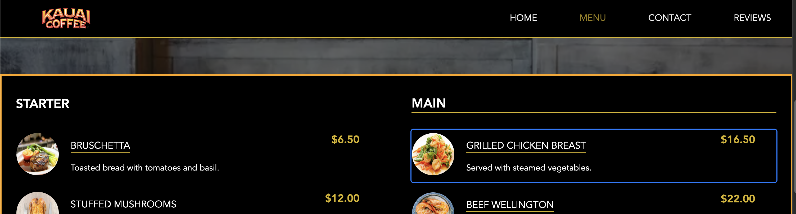

# ☕ Cafeteria Website

Web Development project for OPIT BSc in Computer Science

- [☕ Cafeteria Website](#-cafeteria-website)
  - [📄 Project Overview](#-project-overview)
  - [🗂️ Folder Structure](#-folder-structure)
  - [🧠 Features](#-features)
    - [✅ Sections](#-sections)
    - [🎯 Accessibility Features](#-accessibility-features)
    - [🧽 Keyboard Navigation](#-keyboard-navigation)
  - [✨ Accessibility Guidelines Followed](#-accessibility-guidelines-followed)
  - [🧪 Testing Accessibility](#-testing-accessibility)
  - [⚙️ Development](#-development)
  - [🌎 Compatibility](#-compatibility)

## 📄 Project Overview

This is a fully responsive, accessible, and interactive landing page for a cafeteria. It showcases essential sections like menu, booking, reviews, contact, and more with keyboard navigation and ARIA enhancements for better usability.

🔗 **Live**: [cafeteria-website](https://bozzelliandrea.github.io/cafeteria-website/)

---

## 🗂️ Folder Structure

```
/cafeteria-website/
│
├── package.json
├── vite.config.js
├── src/
│   └── index.html
│   └── index.js
│   └── components/
│   └── sections/
├── assets/
│   ├── *.png
│   └── fonts/
```

**package.json** project manifest with node scripts and development dependencies for utility tools

**vite.config.js** vite configuration to build optimized dist folder

**src/index.html** main html page entry point

**src/index.js** main script for website composition

**src/sections** contains every section component folder consisting of `section.js|scss|html`

## 🧠 Features

### ✅ Sections

- **Navbar**
- **Slider**
- **Menu Section**
- **Booking Section**
- **Reviews Section**
- **Contact Section**

### 🎯 Accessibility Features

- Semantic HTML (`<section>`, `<nav>`, `<form>`, etc.)
- ARIA roles and labels
- Keyboard navigation (Arrow Keys + Escape)
- Focus management (visible outlines, tabindex)
- Skip to content behavior (optional to add)
- Color contrast optimized
- Screen-reader support
- Logical heading structure (`<h1>`, `<h2>`, etc.)

### 🧽 Keyboard Navigation



- `ArrowDown / ArrowUp`: Move between major sections
- `ArrowRight / ArrowLeft`: Navigate within a section
- `Tab`: Alternative to move between single elements
- `Escape`: Exit inner focus to section level
- Current section: Highlighted with orange border
- Inner element: Highlighted with blue border

---

## ✨ Accessibility Guidelines Followed

Chrome Lighthouse accessibility test result


| Guideline             | Applied |
| --------------------- | ------- |
| Keyboard Navigation   | ✅      |
| Screen Reader Support | ✅      |
| ARIA Roles            | ✅      |
| Semantic HTML         | ✅      |
| Focus Indicators      | ✅      |
| Responsive Design     | ✅      |
| Color Contrast        | ✅      |

---

## 🧪 Testing Accessibility

You can use tools like:

- Chrome Lighthouse Audit (DevTools → Lighthouse → Accessibility)
- axe DevTools (browser extension)
- Screen Readers (VoiceOver on macOS, NVDA for Windows)

## ⚙️ Development

The website use native Javascript `ES6`, HTML and Scss with sass preprocessor for CSS.

As a build tool is used `vite` to generate dist folder and assets optimization, the project is structured as follow:

1. `index.html` is the entrypoint of the application, instantly load a `module` script `index.js`
2. `index.js` load the `arrow-navigation` as keyboard navigator manager and every section to render inside the website in the current order:
   - slider (await assets preloading)
   - navbar
   - menu
   - contact
   - booking
   - reviews
   - footer
3. each `js` file imports its own `scss` definition (or a global one) to add style selector to child **DOM** elements

Within the page there is also custom handling of rendering events:

- `DOMContentLoaded` native DOM event, fired when `document` object is loaded.
- `WebAppInvoker_ContentLoading` custom event, used to trigger each section and render every inner element.
- `SectionRender_${SectionName}_Complete` custom event, fired after section was built, and used by the `arrow-navigation.js` to handle and attach keyboard navigation.

## 🌎 Compatibility

Here you can find the compatibility matrix for the Javascript code used by the website:

| **Browser**            | **Version (min.)** | **Release Date** | **Supports ES Modules** | **Supports `async/await`** |
| ---------------------- | ------------------ | ---------------- | ----------------------- | -------------------------- |
| **Chrome**             | 61+                | Jun, 2017        | Yes                     | Yes                        |
| **Firefox**            | 60+                | May, 2018        | Yes                     | Yes                        |
| **Safari**             | 11+                | Sep, 2017        | Yes (Safari 10+)        | Yes                        |
| **Edge**               | 16+                | Oct, 2017        | Yes                     | Yes                        |
| **Opera**              | 48+                | Sep, 2017        | Yes                     | Yes                        |
| **Internet Explorer**  | **N/A**            | **N/A**          | No                      | No                         |
| **Android Browser**    | 61+                | Sep, 2017        | Yes                     | Yes                        |
| **Chrome on Android**  | 61+                | Sep 2017         | Yes                     | Yes                        |
| **Safari on iOS**      | 10.3+              | Mar, 2017        | Yes                     | Yes                        |
| **Samsung Internet**   | 8.0+               | Jul, 2018        | Yes                     | Yes                        |
| **Firefox on Android** | 60+                | May, 2018        | Yes                     | Yes                        |
| **WebView Android**    | 61+                | Sep, 2017        | Yes                     | Yes                        |
